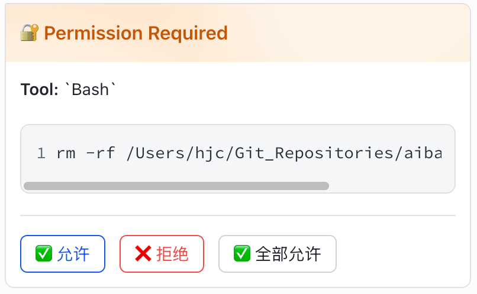

# cc-feishu-connector

在飞书聊天窗口中使用 Claude Code — 支持完整的交互式卡片、权限审批、会话管理。

> **来源说明**：本项目 fork 自 [jawkjiang/cc-feishu](https://github.com/jawkjiang/cc-feishu)，在原项目基础上新增了消息表情反应、工作区别名系统、完整 thinking 显示，以及修复了多项 bug。

[English README](./README.en.md)

---

## 功能特性

- 🎨 **富交互卡片** — 实时流式显示 thinking、tool calls、代码 diff、执行结果
- 🔐 **权限审批** — Claude 执行敏感操作时在飞书弹出审批按钮，支持允许/拒绝/全部允许
- ⏹ **中断执行** — 使用 `/esc` 随时中断，会话保持活跃
- 🔄 **会话恢复** — `--resume` 从历史列表选择恢复，`--continue` 延续最近会话
- 📁 **工作区别名** — `/ws add <alias> <path>` 保存常用目录，`/run <alias>` 快速启动
- 📝 **消息排队** — 同一会话内消息按序处理，不丢消息

---

## 前置要求

- Node.js 22+
- [Claude Code CLI](https://docs.anthropic.com/en/docs/claude-code) (`npm install -g @anthropic-ai/claude-code`)
- 飞书企业自建应用（下文有配置步骤）

---

## 一、配置飞书机器人

### 1. 创建应用

1. 登录 [飞书开放平台](https://open.feishu.cn/app)，点击 **创建企业自建应用**
2. 填写应用名称和描述（如 "Claude Code"），创建完成后进入应用详情

### 2. 获取凭证

在 **凭证与基础信息** 页面，复制 **App ID** 和 **App Secret**，后续配置使用。

### 3. 开启机器人能力

进入 **应用功能 → 机器人**，点击开启机器人能力。

### 4. 配置权限

进入 **权限管理**，搜索并开启以下权限：

| 权限标识 | 说明 |
|---------|------|
| `im:message` | 读取与发送消息 |
| `im:message:send_as_bot` | 以应用身份发送消息 |
| `im:message.react.emoji:write` | 添加/移除消息表情反应 |

### 5. 订阅事件

进入 **事件与回调**：

1. **订阅方式**选择 **使用长连接接收事件/回调**（无需公网服务器）
2. 在 **添加事件** 中搜索并订阅 `im.message.receive_v1`（接收消息）
3. 在 **卡片回调** 中选择 **card.action.trigger**（接收卡片按钮点击）

> ⚠️ 长连接模式下，机器人以 WebSocket 方式主动连接飞书，无需配置回调 URL。

### 6. 发布应用

完成以上配置后，在 **版本管理与发布** 中创建版本并申请发布。企业内部应用通常无需审核，管理员直接发布即可。

---

## 二、安装

### 方式一：npm 全局安装（推荐）

```bash
npm install -g @hyposomnia/cc-feishu-connector
```

安装后直接使用 `ccfc` 命令。

### 方式二：从源码构建

```bash
git clone https://github.com/hyposomnia/cc-feishu-connector.git
cd cc-feishu-connector
npm install
npm run build
npm link   # 将 ccfc 链接到全局命令
```

---

## 三、配置凭证

```bash
# 设置飞书 App ID 和 App Secret
ccfc config set feishu.app_id cli_xxxxxxxxxxxxxxxx
ccfc config set feishu.app_secret xxxxxxxxxxxxxxxxxxxxxxxxxxxxxxxx

# 可选：设置默认模型
ccfc config set defaults.model claude-opus-4-6

# 查看当前配置
ccfc config show
```

配置文件保存在 `~/.cc-feishu-connector/config.toml`，也可以直接编辑：

```toml
# ~/.cc-feishu-connector/config.toml

[feishu]
# 必填：飞书应用凭证（在飞书开放平台"凭证与基础信息"页面获取）
app_id = "cli_xxxxxxxxxxxxxxxx"
app_secret = "xxxxxxxxxxxxxxxxxxxxxxxxxxxxxxxx"

[defaults]
# 可选：默认使用的 Claude 模型，留空则使用 claude 命令的默认模型
# 可选值示例：claude-opus-4-6、claude-sonnet-4-6、claude-haiku-4-5
model = "claude-sonnet-4-6"
```

所有配置项说明：

| 配置键 | 必填 | 说明 |
|--------|------|------|
| `feishu.app_id` | ✅ | 飞书应用 App ID，格式为 `cli_` 开头 |
| `feishu.app_secret` | ✅ | 飞书应用 App Secret |
| `defaults.model` | ❌ | 默认 Claude 模型，可被 `/start --model` 参数覆盖 |

---

## 四、启动服务

```bash
# 前台运行（可查看实时日志）
ccfc start

# 安装为 macOS 系统服务（开机自启）
ccfc service install
ccfc service status
ccfc service restart
ccfc service uninstall
```

> **注意**：`ccfc service *` 系统服务管理仅支持 macOS。
> Windows 用户请使用 `ccfc start` 前台运行，或通过
> [NSSM](https://nssm.cc) / 任务计划程序注册为后台服务。

启动后日志显示 `ws client ready` 表示已连接飞书。

---

## 五、在飞书中使用

### 启动 Claude Code 会话

在飞书私聊机器人，或将机器人加入群聊后 @机器人，发送：

```
/start /path/to/your/project
```

或使用工作区别名（见下文）：

```
/run my-project
```

**支持的启动参数：**

```
/start /path/to/project                      # 基础启动
/start /path/to/project --continue           # 继续最近一次会话
/start /path/to/project --resume             # 从历史列表选择会话恢复
/start /path/to/project --model claude-opus-4-6     # 指定模型
/start /path/to/project --dangerously-skip-permissions  # 跳过所有权限确认
```

### 与 Claude 对话

会话启动后，直接发送消息即可：

```
帮我读一下 package.json 然后加个 lint script
```

Claude 的响应以交互式卡片展示：
- 💭 **思考过程**（可折叠）
- 🔧 **工具调用**（Read、Edit、Bash 等）
- 📝 **代码 diff**（+/- 标记）
- ✅ **最终结果**
- 📊 **统计信息**（tokens、费用、耗时）

### 权限审批

Claude 执行敏感操作时弹出审批卡片：



点击按钮后卡片更新为已响应状态：


点击按钮即可批准或拒绝，"全部允许"会跳过本次会话后续所有权限确认。

### 工作区别名

保存常用项目路径，快速启动：

```
/ws add my-project /Users/me/projects/my-project
/ws add backend /Users/me/work/backend

/run my-project           # 等同于 /start /Users/me/projects/my-project
/run backend --continue   # 继续 backend 项目的最近会话

/ws list                  # 查看所有别名
/ws delete my-project     # 删除别名
```

### 完整命令列表

| 命令 | 说明 |
|-----|------|
| `/start <path\|alias> [flags]` | 启动 Claude Code 会话 |
| `/run <path\|alias> [flags]` | 同 `/start` |
| `/stop` | 停止当前会话 |
| `/esc` 或 `/interrupt` | 中断当前执行（相当于 Ctrl+C） |
| `/status` | 查看当前会话状态 |
| `/config [set <key> <value>]` | 查看或修改配置 |
| `/ws add <alias> <path>` | 添加工作区别名 |
| `/ws list` | 列出所有别名 |
| `/ws delete <alias>` | 删除别名 |
| `/help` | 显示帮助 |

---

## 架构

```
飞书用户 ←─WebSocket─→ FeishuGateway ←──────────────────────── SessionManager
                            │                                         │
                       CallbackRouter                           ClaudeAgent
                      （卡片按钮回调）                    （子进程 stdin/stdout）
                                                                      │
                                                              本地项目文件系统
```

- **FeishuGateway** — WebSocket 长连接，收发消息和卡片
- **SessionManager** — 每个 chatId 对应独立会话，空闲 30 分钟自动停止
- **ClaudeAgent** — spawn `claude --print --input-format stream-json --output-format stream-json`
- **StreamingCard** — 节流更新飞书卡片（thinking 500ms，text 300ms）
- **PermissionHandler** — 拦截权限请求，弹出审批卡片并等待响应

---

## 注意事项

- 每个飞书聊天窗口（私聊/群聊）对应一个独立的 Claude Code 子进程
- 会话空闲 30 分钟后自动停止
- 服务运行在本地，Claude Code 操作的是**本机文件系统**，确保路径正确
- 群聊中需要 @机器人才能触发响应

---

## License

MIT
